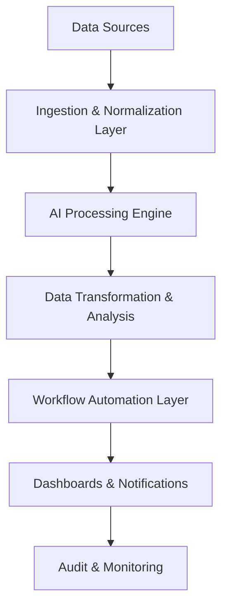

# 🧬 DataSynth AI

AI-driven platform for automated data processing, transformation, and actionable insight generation. Extract value from massive datasets, automate workflows, and make predictive decisions in real time.

**[Features](#-features)** •
**[Architecture](#-architecture)** •
**[Tech Stack](#-tech-stack)** •
**[Setup](#-getting-started)** •
**[Impact](#-real-world-impact)**

---

## 🎯 Overview

**DataSynth AI** is a powerful AI-driven platform for automated data processing, transformation, and actionable insight generation. Built for enterprises and SaaS providers, it enables organizations to extract value from massive datasets and make predictive decisions in real time.

### Key Capabilities:

- 📥 **Automated Ingestion** - Collect data from APIs, databases, cloud storage, and live streams
- 🤖 **AI-Powered Transformation** - Clean, normalize, and transform data automatically
- 📊 **Predictive Analytics** - Run real-time models to forecast trends and outcomes
- ⚙️ **Workflow Automation** - Trigger actions based on AI insights
- 🔌 **Enterprise Integration** - Seamless connection with CRMs and SaaS platforms
- 📈 **Real-Time Monitoring** - Track pipeline performance and data quality
- 🚀 **Scales Massively** - Handles terabytes of data and thousands of processes
- 🔒 **Enterprise Security** - End-to-end encryption and audit trails

---

## ✨ Features

| Feature | Description |
|---------|-------------|
| 📥 **Automated Data Ingestion** | Connect and collect data from APIs, databases, cloud storage, and live streams |
| 🤖 **AI-Powered Transformation** | Clean, normalize, and transform data automatically using AI models |
| 📊 **Predictive Analytics** | Run real-time predictive models to forecast trends and outcomes |
| ⚙️ **Workflow Automation** | Trigger actions, notifications, and system updates based on AI insights |
| 🧩 **Customizable Pipelines** | Build modular and reusable data pipelines for diverse business needs |
| 🔗 **Multi-Source Integration** | Seamless integration with CRMs, SaaS platforms, and messaging systems |
| 📈 **Real-Time Monitoring** | Track pipeline performance, data quality, and AI decisions |
| 🚀 **Enterprise Scale** | Handles terabytes of data and thousands of concurrent processes |
| 🔐 **Security & Compliance** | End-to-end encryption, access control, and audit trails |

---

## 🏗️ Architecture

### System Components

| Component | Purpose |
|-----------|---------|
| **Ingestion Layer** | Aggregates data from multiple sources and prepares it for AI processing |
| **AI Processing Engine** | Executes predictive models and intelligent transformations on raw data |
| **Transformation & Analysis** | Converts raw inputs into structured, actionable insights |
| **Workflow Automation** | Automates responses, updates, and alerts based on AI outputs |
| **Dashboards & Notifications** | Presents real-time analytics to users and stakeholders |
| **Audit & Monitoring** | Maintains logs and metrics for compliance and security |

---

## 📈 Real-World Impact

| Benefit | Improvement |
|---------|-------------|
| ⏱️ **Processing Time** | Reduces manual data preparation by 70–80% |
| 🧠 **Decision Making** | Enables predictive insights across business units |
| ⚙️ **Automation** | Automates complex multi-step workflows with AI logic |
| 📈 **Scalability** | Supports enterprise operations with thousands of pipelines |
| 💡 **Insights** | Provides actionable insights improving operational efficiency |

---

## 🛠️ Tech Stack

### Backend
- **Language:** Python 3.11
- **Framework:** FastAPI
- **Orchestration:** Apache Airflow
- **Task Queue:** Celery + Redis

### Frontend
- **Framework:** React 18
- **Styling:** TailwindCSS
- **Visualization:** Recharts, D3.js

### AI/ML
- **LLM:** OpenAI GPT / Gemini API
- **Models:** Custom predictive and transformation models

### Infrastructure
- **Primary Database:** PostgreSQL
- **Document Store:** MongoDB
- **Cache:** Redis
- **Message Queue:** RabbitMQ, Kafka
- **Containerization:** Docker
- **Orchestration:** Kubernetes
- **Cloud:** AWS (S3, Lambda, EKS)
- **Monitoring:** Prometheus & Grafana

---

## 📊 Pipeline Management

### Data Ingestion
- Source connectors (APIs, databases, files)
- Real-time streaming support
- Data validation and quality checks

### Processing
- AI-powered transformations
- Custom script execution
- Multi-step workflow chains

### Output & Analytics
- Multiple destination targets
- Real-time dashboards
- Automated notifications

---

## 🔐 Security & Compliance

- **Authentication:** JWT with Multi-Factor Authentication (MFA)
- **Authorization:** Role-Based Access Control (RBAC)
- **Encryption:** End-to-end encryption for data in transit and at rest
- **Audit Logging:** Complete activity tracking and reporting
- **Data Isolation:** Tenant separation at database level
- **Compliance:** GDPR, HIPAA, SOC 2 ready
- **Rate Limiting:** API throttling and DDoS protection

---

## 🤝 Contributing

Contributions are welcome! Please follow these guidelines:

1. Fork the repository
2. Create a feature branch (`git checkout -b feature/AmazingFeature`)
3. Commit your changes (`git commit -m 'Add AmazingFeature'`)
4. Push to the branch (`git push origin feature/AmazingFeature`)
5. Open a Pull Request

---

## 📄 License

MIT License © m-shamim09

See [LICENSE](LICENSE) for details.

---

---

---

---

---

---

## Author & Contact

- **Author:** Muhammad Shamim
- **GitHub:** [@m-shamim09](https://github.com/m-shamim09)
- **Email:** [mshamim.work@gmail.com](mailto:mshamim.work@gmail.com)
- **Profile:** https://github.com/m-shamim09

